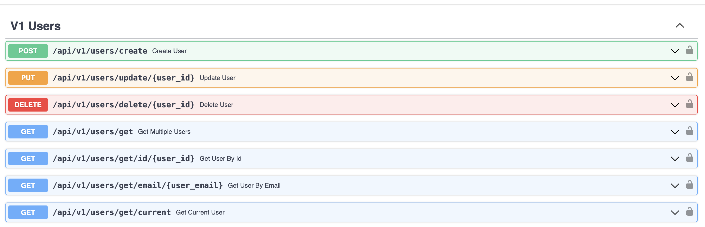
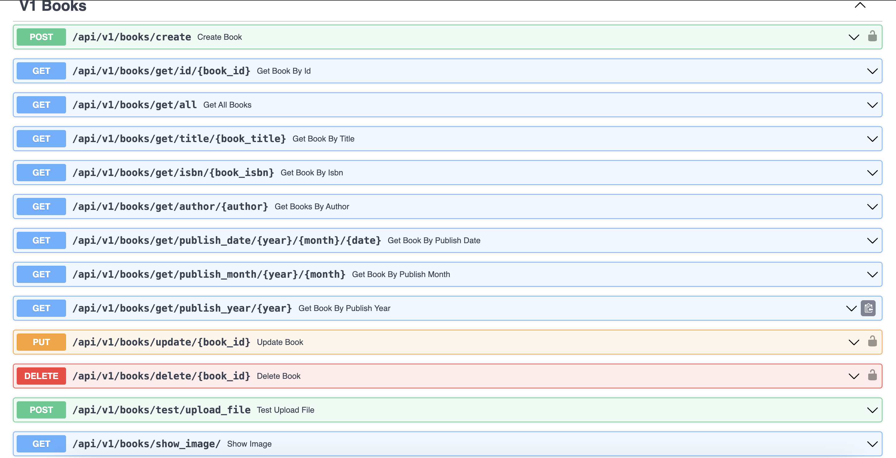
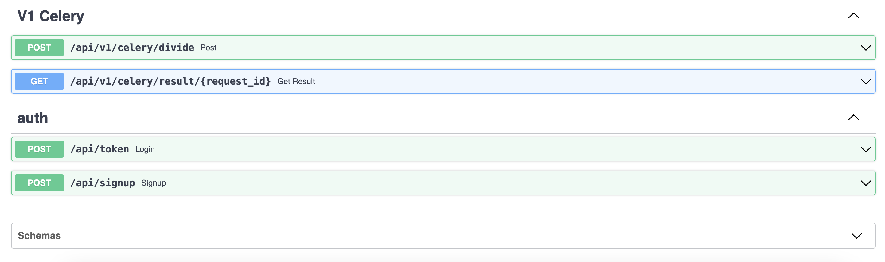
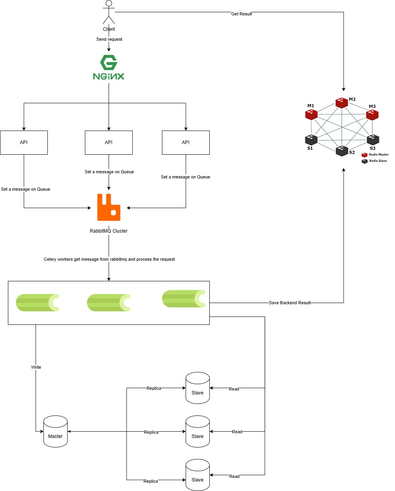

# FASTAPI-ASSIGNMENT

## Features

- FastAPI with python3.10.13
- Postgres
- sqlALchemy for migrations
- Pytest for api tests
- Docker compose for easier development

## Development
The only dependencies for this project should be docker and docker-compose.

### Quick Start
Starting the project with hot-reloading enabled
(the first time it will take a while):


Note: Create `logs/api/` and `logs/celery/` directory at the same level of docker-compose file before starting the project

```bash
docker compose up -d
```

init database api
```bash
docker exec -it postgres psql -U admin -d api -f mnt/init_sql/init.sql 
```

## Testing

### Backend Tests

```
docker exec -it api pytest
```

## Project Layout

```
api
├── app
│    ├── api
│    │   └── v1
│    │       ├── auth.py
│    │       ├── books.py
│    │       ├── celery.py (Optional: for distributed systems)
│    │       └── users.py
│    │       
│    ├── core  
│    │   ├── authentication.py  
│    │   ├── celery.py  
│    │   ├── config.py  
│    │   └── security.py 
│    │   
│    ├── db 
│    │   ├── crud 
│    │   │   ├── book.py
│    │   │   └── user.py
│    │   ├── models
│    │   │   ├── base.py
│    │   │   ├── book.py
│    │   │   └── user.py
│    │   ├── schemas
│    │   │   ├── token.py
│    │   │   ├── book.py
│    │   │   └── user.py
│    │   └── session.py  
│    │   
│    ├── handlers
│    │   └── exception.py 
│    ├── utils (For reusable functions)
│    │   ├── storage.py  
│    │   └── time.py 
│    ├── test_main.py
│    └── main.py 
├── Dockerfile
│    ├── init.sql
│    └── insert_db.sh
├── Dockerfile
├── requirements.txt
├── openapi.json 
├── docker-compose.yaml
├── api.env
├── rabbitmq.env
└── worker.env
```

### NOTE: 
* You can get the openAPI specification to interact with the API through the endpoint localhost:8081/openapi.json or the openapi.json file in the repo 
* For convienience you can test the API through the swagger doc at localhost:8081/docs 

## API Endpont list





### Optional tasks:
- Upload image: Already implemented but this method is saving image into the local storage. Future work: save image into s3 object storage (Ceph, Minio)
- Rate limiting: Use Redis and window functions (Not implemented yet, base on the idea from this URL https://dev.to/dpills/how-to-rate-limit-fastapi-with-redis-1dhf)
- 1000 requests per second: Use celery, rabbitmq, Redis and Replica-database (Not implemented yet, presented in diagram)

### System Diagram:



### Repo Status
Still Update until I feel it's perfect